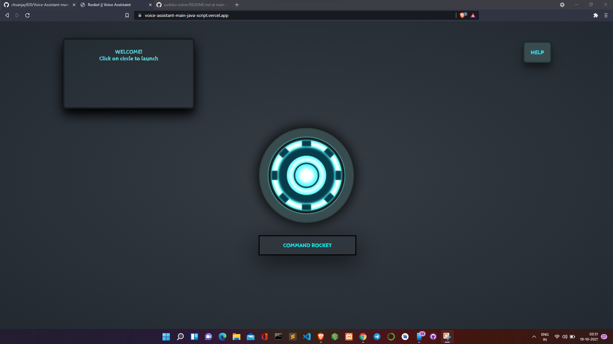

# web-based voice assistant

this is a project which mainly uses the javascrip to process it with voice commands. 

coded this project in java-script and with some HTML and deployed it as a simple webpage.

[webpage link](https://voice-assistant-main-java-script.vercel.app/)

## Screen shot:

<!--  -->
<a href="https://sudoku-solver-by-sanjay.vercel.app">

  

</a>

## Contributing
Pull requests are welcome. For major changes, please open an issue first to discuss what you would like to change.

Please make sure to update tests as appropriate.

## License
[MIT](https://github.com/chsanjay920/Voice-Assistant-main-javaScript/blob/main/LICENSE)
